## Interfacing research, software engineering, and high-performance computing

.footnote[Bundesarchiv, B 145 Bild-F038812-0014, Lothar Schaack (CC-BY-SA 3.0 DE)]

---

class: center, middle, inverse

# Interfacing research, software engineering, and high-performance computing

## Radovan Bast [@\_\_radovan](https://twitter.com/__radovan)

Nordic e-Infrastructure Collaboration/
UiT The Arctic University of Norway

## Slides: http://bit.ly/lille-2019

---

## About me

.left-column[

- Theoretical chemist turned research software engineer.
- I write research software and teach programming to researchers and lead the
  [CodeRefinery project](https://coderefinery.org).
- Co-author of the CMake Cookbook.
]

.right-column[
### Code projects

- DIRAC
- Dalton
- OpenRSP
- XCint
- XCFun
- Numgrid
- GIMIC
- Parselglossy
- Autocmake
- Runtest
- Sonar
- Smeshing
- Blob
- SMARTool
]

---

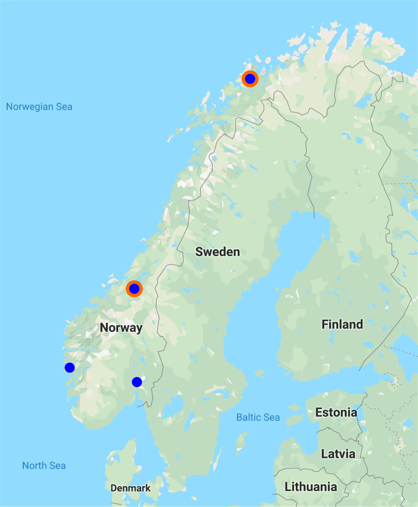

---

class: center, middle

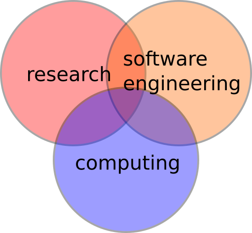

---

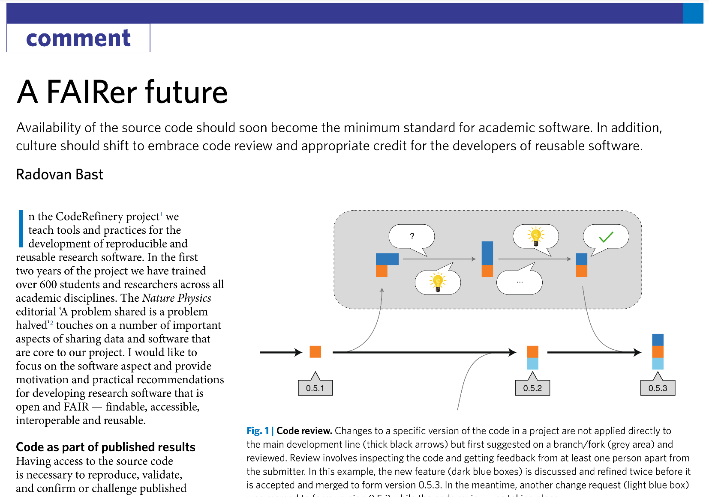

.cite["A FAIRer future" Nat. Phys. 15, 728–730 (2019), https://doi.org/10.1038/s41567-019-0624-3]

---

## CodeRefinery

We teach tools and practices for the
development of reproducible and reusable research software.

.left-column[

- https://coderefinery.org
- https://coderefinery.org/workshops/
]
.right-column[

]

---

## CodeRefinery

- We have trained .emph[over 600 students and researchers]
- Across all academic disciplines
- Funding for 2 more years

.left-column[
### Our goal

Advance .emph[FAIRness] of software management and development practices so that research groups can
.emph[collaboratively develop], review, discuss, test, share, and reuse their codes.
]
.right-column[
### Our [lessons](https://coderefinery.org/lessons/)

- Basic and collaborative Git
- Git branch design
- Code documentation
- Automated testing
- Jupyter notebooks
- Integrated development environments
- Building portable code with CMake
- Social coding and open software
- Modular code development
- Reproducible research
]

---

## CodeRefinery: what is our impact?

.footnote[https://coderefinery.org]

---

## CodeRefinery: lessons learned

### Demand

- .emph[Demand for training] is huge.
- [The Carpentries](https://carpentries.org) offer great courses in basics but there is .emph[need for more advanced courses].

### Collaborative version control

- Around a third of workshop participants are new to .emph[version control].
- Very few participants use .emph[code review] and .emph[automated testing] before arriving at our workshop.

### FAIR

- .emph[Software licensing and copyright] aspects are new to most participants.
- Code publishing and .emph[code citation principles] are new to most participants.
- .emph[FAIR principles] in software management are far from standard.

---

class: center, middle, inverse

## Software reproducibility 10-year challenge:

# Try to build **your code** from 10 years ago

---

## Software reproducibility 10-year challenge

### Couple of uncomfortable questions:

- Can you still .emph[find] your code?
- It was probably not on GitHub (GitHub launched only 11 years ago, GitLab is only 6 years old).
- Can you bring it to a .emph[well-defined state]?
- Can you find corresponding documentation?
- How about .emph[external dependencies]? Have you locked their versions?
- Have you used Git submodules? Have they moved?
- Any hard-coded paths?
- If you manage to build it, how do you know it produces the same results as in the past?

---

ReproHack is a one day, hands-on reproducibility hackathon

- https://reprohack.github.io/reprohack-hq/
- [Reprohacking at CarpentryConnect Manchester 2019](https://software.ac.uk/blog/2019-08-07-reprohacking-carpentryconnect-manchester-2019)
- [ReproHack: one-day reproducibility hackathons (Anna Krystalli)](https://annakrystalli.me/talks/ro-reprohack.html)

---

## Have you ever seen these sentences?

.quote["software used in this study is available upon request"]

- What does this mean in terms of findability and accessibility?

.quote["we have used a locally modified version of code X"]

- What does this mean in terms of findability, accessibility, and reproducibility?

---

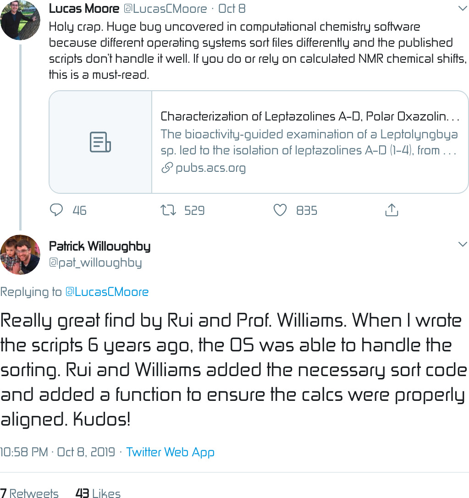

.cite[https://pubs.acs.org/doi/10.1021/acs.orglett.9b03216]

---

## Great project: Software Heritage

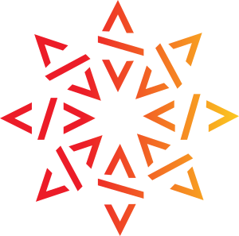

### https://www.softwareheritage.org

### [@swheritage](https://twitter.com/swheritage)

Building the universal software archive.

Collects, preserves, and shares software source code for present and future
generations.

.emph[Initiated by Inria], the French national research institute for the digital sciences.

---

## Publishing computational results without accompanying code will become unacceptable

.quote["With some exceptions, anything else than the release of source programs is intolerable for results that depend on computation"]
.cite[Ince, D. C., Hatton, L. & Graham-Cumming, J., Nature 482, 485 (2012)]

.quote["Programs should be published in source language (rather than binary)"]
.cite[Roberts, K. V., Comput. Phys. Comm. 1, 1 (1969)]

.quote["The scientific community should always be able to verify that a published program will produce correct results"]
.cite[Roberts, K. V., Comput. Phys. Comm. 1, 1 (1969)]

---

## "The publication of scientific Fortran programs"

.cite[https://doi.org/10.1016/0010-4655(69)90011-3]

---

## "The publication of scientific Fortran programs"

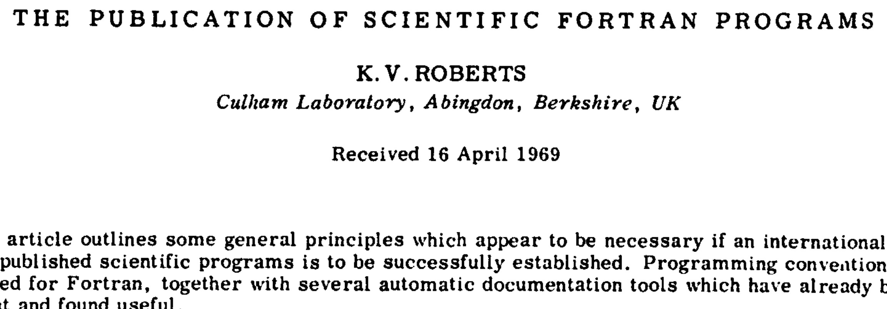

.cite[https://doi.org/10.1016/0010-4655(69)90011-3]

---

## Journal policy as motivation for sharing

[From Science editorial policy:](https://www.sciencemag.org/authors/science-journals-editorial-policies)
> "We require that all computer code used for modeling and/or data analysis
> that is not commercially available be deposited in a publicly accessible
> repository upon publication. In rare exceptional cases where security
> concerns or competing commercial interests pose a conflict, code-sharing
> arrangements that still facilitate reproduction of the work should be
> discussed with your Editor no later than the revision stage."

 [From Nature editorial policy:](https://www.nature.com/authors/policies/availability.html)
> "An inherent principle of publication is that others should be able to
> replicate and build upon the authors' published claims. A condition of
> publication in a Nature Research journal is that authors are required to make
> materials, data, code, and associated protocols promptly available to readers
> without undue qualifications. Any restrictions on the availability of
> materials or information must be disclosed to the editors at the time of
> submission. Any restrictions must also be disclosed in the submitted
> manuscript."

---

## Journal policy as motivation for sharing

However a study showed that despite these policies, many people still do not share their code 😞 : [https://www.pnas.org/content/115/11/2584](https://www.pnas.org/content/115/11/2584). This paper includes samples of charming author responses such as
> "When you approach a PI for the source codes and raw data, you better explain
> who you are, whom you work for, why you need the data and what you are going
> to do with it."

---

## Sharing papers

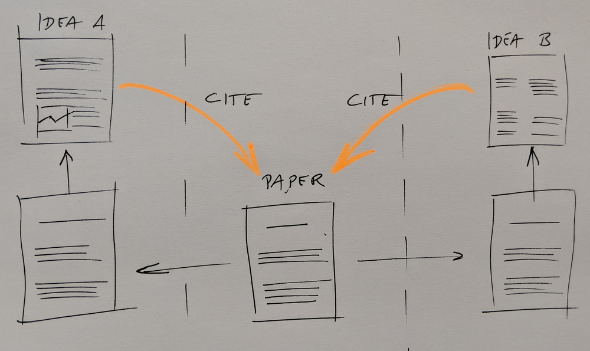

- We want maximum visibility and maximum reuse.
- The more interesting science is done referencing my paper, the better for me.

---

## Sharing code

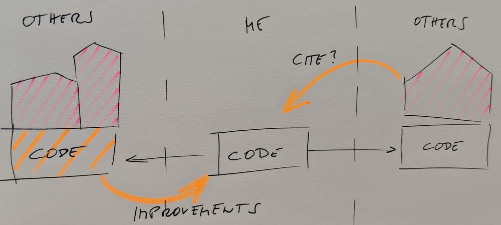

.quote["I did all the ground work and they get to do the interesting science?"]

- Sharing code and encouraging derivative work may boost your academic impact.

---

## Code review should become a standard practice

.quote["A program should be carefully checked by colleagues [...] before it is submitted for publication [...] and it should be refereed"]
.cite[Roberts, K. V., Comput. Phys. Comm. 1, 1 (1969)]

---

## Code review

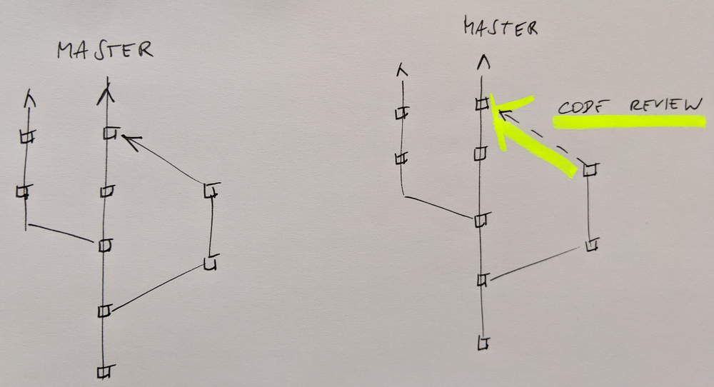

.cite["A FAIRer future" Nat. Phys. 15, 728–730 (2019), https://doi.org/10.1038/s41567-019-0624-3]

- Review and discuss changes .emph[before they are merged]
- Good idea if junior student reviews code of senior colleague
- .emph[Great learning opportunity]
- Consider code reading sessions in your group

---

## Social coding

.cite[Idea: R. Darst, adapted]

- Whether you can share your output depends on how you obtained your input.
- .emph[Software licenses matter].
- Sometimes "OTHERS" are you yourself in the future.

---

class: center, middle, inverse

## Code is on GitHub with a standard open source license

# Is this enough?

---

## Public access alone may not be enough

- Assigning a .emph[digital object identifier] (DOI) to the version referenced in a published manuscript .emph[is a must].

### Great services to get a DOI

- [Zenodo](https://zenodo.org)
- [Open Science Framework](https://osf.io)
- [Software Heritage](https://www.softwareheritage.org)
- [Dataverse](https://dataverse.org)
- [Figshare](https://figshare.com)

.quote["A published program will form part of a permanent international literature"]
.cite[Roberts, K. V., Comput. Phys. Comm. 1, 1 (1969)]

### Publishing papers about software

- [The Journal of Open Source Software](https://joss.theoj.org/about)
- [In which journals should I publish my software?](https://www.software.ac.uk/resources/guides/which-journals-should-i-publish-my-software)
- https://www.force11.org/software-citation-principles

---

class: center, middle, inverse

## Challenges

## We more or less have the tools, **what are we missing**?

---

## Write programs for people

.quote["Write each program, quite deliberately, for other people to read and understand"]
.cite[Roberts, K. V., Comput. Phys. Comm. 1, 1 (1969)]

.quote["Many programs remain in use much longer than their authors originally expect"]
.cite[Roberts, K. V., Comput. Phys. Comm. 1, 1 (1969)]

---

## Establishing a culture and the need for training

- We need to support a .emph[culture of sharing].
- Encourage, credit, and eventually expect openness.
- Challenge for students and researchers, principal investigators, editors, referees,
  funding bodies, and hiring committees.
- .emph[Training is critical].

---

## Credit

.quote["it is important to attract the right people, and one of their main incentives will be the credit"]
.cite[Roberts, K. V., Comput. Phys. Comm. 1, 1 (1969)]

- Make it possible to show their work on their CV.
- Help creating an ecosystem where such CVs count.
- Create and support .emph[career paths].

---

## Research software engineers

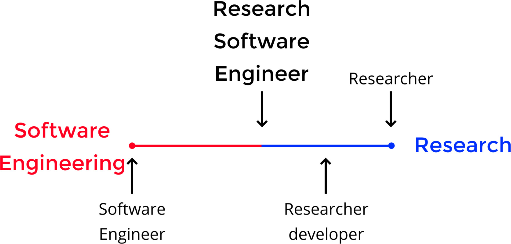

.cite[https://slides.com/simonhettrick/why-recognising-scientific-software-experts-is-key-to-open-science#/4/2]

---

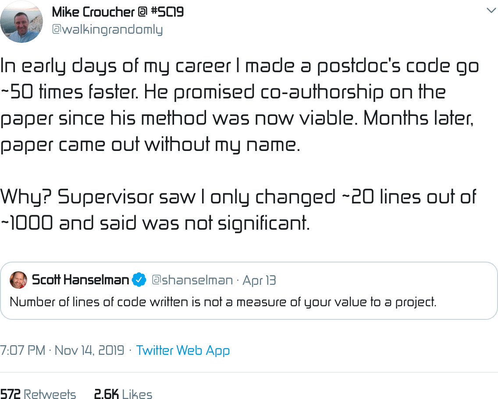

.cite[https://twitter.com/walkingrandomly/status/1195040508239851521]

---

## Recommendations for research software engineering

- Encourage students/staff to take training.
- Support .emph[training activities]:
  **tell your university leaders about Carpentries and CodeRefinery**.
- .emph[Encourage sharing] and open source.
- Use .emph[code review] in your group.
- Consider FAIR principles from the start.
- Spending a month on learning version control, editor, scripting, 1-2 programming
  languages really well is not a waste of time.
- Connect with other research software engineers.
- Attract developers with .emph[career opportunities].
- .emph[Influence hiring committees] to not only look at the number of papers - we get what we measure.

---

class: center, middle

---

## [Sigma2 metacenter](https://www.sigma2.no): 4 centers, 2 (soon 3) national clusters

.left-column[
]

.right-column[
- ### Resource usage
- ### Resource usability
]

---

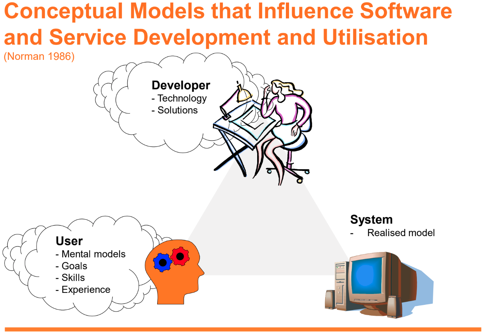

.cite[Slide taken from M. Nieminen, "Usability for HPC users?", presented at NordicHPC 2019: https://nordichpc.github.io/2019-11-14-helsinki/]

---

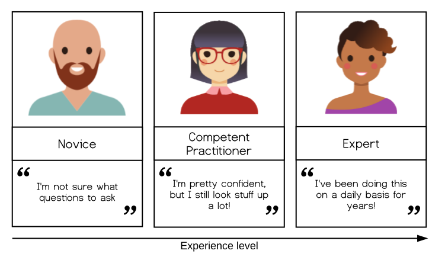

.cite[https://carpentries.github.io/instructor-training/ and references therein]

---

## New domains enter HPC

- Often no concept of what is a node, a core, a thread, MPI, OpenMP
- Often little to no shell and scripting skills
- Often no calibration of scripts
- Often no knowledge or interest in studying job parameters
- Job scripts inherited from generation to generation

---

## What do we expect from a good documentation?

### Documentation comes in different forms - what *is* documentation?

(This is adapted from: [What nobody tells you about documentation](https://www.divio.com/blog/documentation/))

- **Tutorials**: learning-oriented, allows the newcomer to get started
- **How-to guides**: goal-oriented, shows how to solve a specific problem
- **Explanation**: understanding-oriented, explains a concept
- **Reference**: information-oriented, describes the machinery

These are distinct. For an excellent discussion, please see [What nobody tells you about documentation](https://www.divio.com/blog/documentation/).

.quote[It is not enough to show how to specify CPU and memory job parameters,
we also need to show users how to find out what parameters to select.]

---

## The XY problem

.cite[Citing from http://xyproblem.info]

"
- .emph[User wants to do X].
- User doesn't know how to do X, but thinks they can fumble their way to a solution if they can just manage to do Y.
- User doesn't know how to do Y either.
- .emph[User asks for help with Y].
- Others try to help user with Y, but are confused because Y seems like a strange problem to want to solve.
- After much interaction and wasted time, it finally becomes clear that the user really wants help with X, and that Y wasn't even a suitable solution for X.

"

---

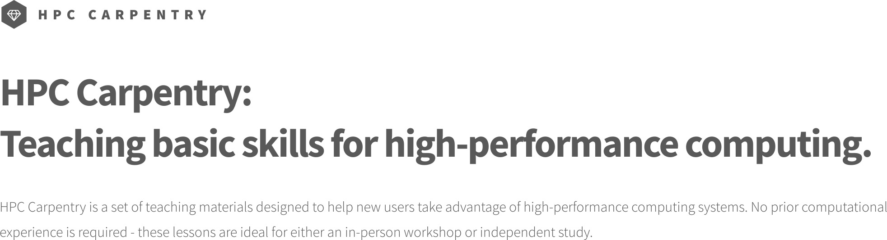

- https://carpentries.org/
- https://hpc-carpentry.github.io/
- Software Carpentry style introduction to MPI: https://rantahar.github.io/introduction-to-mpi/

---

## Top 500

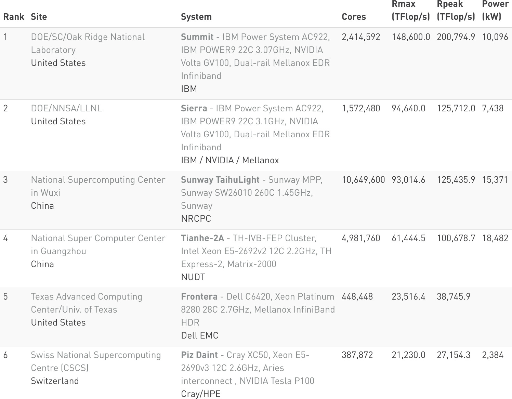

.cite[Nov. 2019, https://www.top500.org/list/2019/11/]

- Is the software keeping up? Are codes ready for GPUs?
- How about usability?

---

## EuroHPC: LUMI

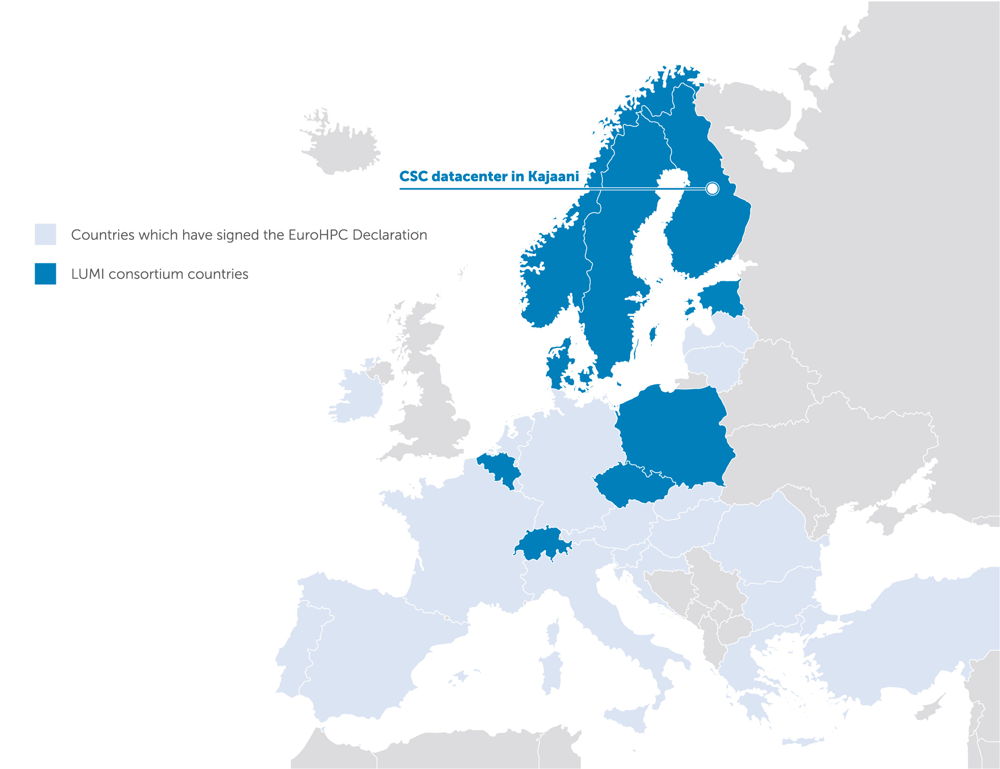

.cite[https://datacenter.csc.fi/collaboration/]

---

## Software installation challenges

- Software dependencies, in particular GUI applications
- Testing
- Sensitive data and network restrictions
- Reproducibility: we cannot remove or change versions

### Typical solutions

- EasyBuild: https://easybuild.readthedocs.io
- Spack: https://spack.io
- Containers are coming: [Singularity](https://sylabs.io/docs/)

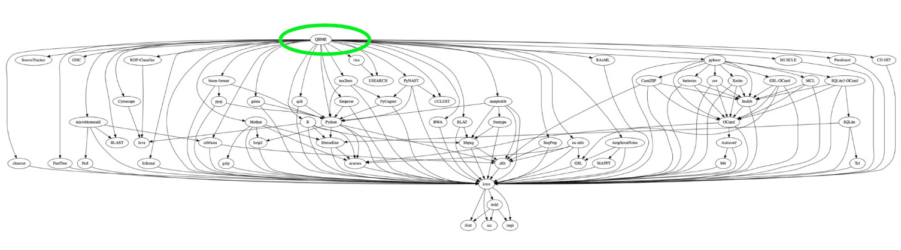

.cite[Software dependency graph from ["How To Make Package Managers Cry"](https://archive.fosdem.org/2018/schedule/event/how_to_make_package_managers_cry/)]

---

## Challenges

- Scaling
- The interface is basically unchanged since the 70ies
- Restart functionality
- Not all jobs are "rectangular" in CPU and memory
- Integration with Jupyter notebooks
- Jupyter close to compute close to data
- Better monitoring of own jobs
- Integration with cloud

---

## NordicHPC

Collaboration of computing facility staff and friends, somewhere between
application experts or sysadmins of clusters, those who are the front line of
supporting research. We have a special focus on usability and reimagining HPC
for the modern age.

.left-column[
- Early 2019: Richard Darst visits Tromsø
- May 2019: Workshop at NeIC conference [Reimagining Research Computing](https://nordichpc.github.io/2019-05-15-neic/)
- In the evening: restaurant visit and discussion
- Decision to organize a [NordicHPC workshop](https://nordichpc.github.io/2019-11-14-helsinki/)

]

.right-column[
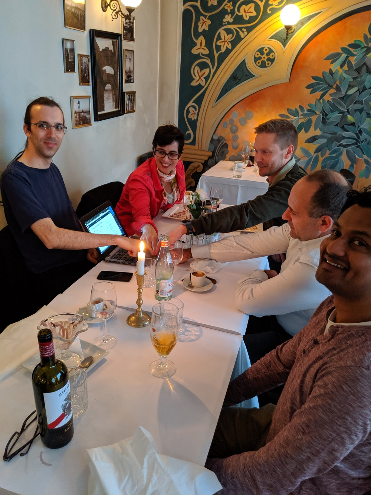
]

---

## HPC cafe (~ monthly events)

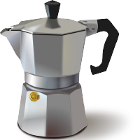

- How to improve your run scripts
- Help with scripting
- Help with programming and software management
- Help with project organization and data management
- Help with Linux stuff
- How to improve performance of your calculations
- .emph[“Papercuts”: things that annoy you and how we can fix that]
- How to improve services
- Project ideas
- Learn about cool services that you may not know yet

[http://hpc.uit.no/en/latest/help/hpc-cafe.html]

---

## Typical papercuts

- Extending jobs
- Bumping job priority
- Understanding job priority
- Application bureaucracy
- Too long queuing time for debug jobs
- Getting test- and course accounts
- No network on compute or even login nodes

---

## Kind requests (slides: http://bit.ly/lille-2019)

### To users

- Please calibrate first, later go for the production calculation
- Create test examples
- Study scaling for a representative system before computing a table

### To developers

- Remember that your code will be installed by scripts and people who have never used
  your code when adding dependencies and changing configuration
- Allow restart

### To computing centers

- Talk with users and listen to what they want and need
- Do not forget usability
- Communicate roadmap
