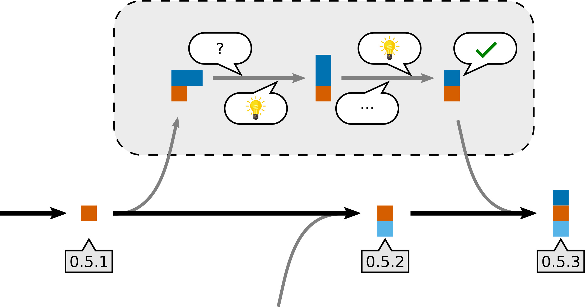

## Coding like it’s 1969


.footnote[Bundesarchiv, B 145 Bild-F038812-0014, Lothar Schaack (CC-BY-SA 3.0 DE)]

---

class: center, middle, inverse

# Research software engineering recipes for the next two decades

## Radovan Bast [@\_\_radovan](https://twitter.com/__radovan)

Nordic e-Infrastructure Collaboration/
UiT The Arctic University of Norway

## Slides: http://bit.ly/cecam-toulouse-bast

---

## About me

- Theoretical chemist turned research software engineer.
- I write research software and teach programming to researchers and lead the
  [CodeRefinery project](https://coderefinery.org).

.left-column[
### Projects

- DIRAC
- Dalton
- OpenRSP
- XCint
- XCFun
- Numgrid
- GIMIC
- Parselglossy
- Autocmake
- Runtest
- Sonar
- Smeshing
]

.right-column[
### Credits/inspiration

- Roberto Di Remigio
- Jonas Juselius
- Richard Darst
- Thor Wikfeldt
- CodeRefinery team
]

---

## CodeRefinery

We teach tools and practices for the
development of reproducible and reusable research software.


- https://coderefinery.org
- https://coderefinery.org/workshops/

---

## CodeRefinery

- We have trained .emph[over 550 students and researchers]
- Across all academic disciplines
- Funding for 2.5 more years

### Our goal

Advance .emph[FAIRness] of software management and development practices so that research groups can
.emph[collaboratively develop], review, discuss, test, share, and reuse their codes.

---

## CodeRefinery

### Our [lessons](https://coderefinery.org/lessons/)

- Basic and collaborative Git
- Git branch design
- Code documentation
- Automated testing
- Jupyter notebooks
- Integrated development environments
- Building portable code with CMake
- Social coding and open software
- Modular code development
- Reproducible research

---

## Goals for this talk

### - Lessons learned from teaching 20 workshops on research software engineering

### - Challenges for the next two decades

- FAIRness in research software development
- Peer review and code review
- Software engineering and academic credit
- Training needs

---

## CodeRefinery: what is our impact? (1/2)


.footnote[https://coderefinery.org]

---

## CodeRefinery: what is our impact? (2/2)


.footnote[https://coderefinery.org]

---

## CodeRefinery: lessons learned

### Demand

- .emph[Demand for training] is huge.
- [The Carpentries](https://carpentries.org) offer great courses in basics but there is .emph[need for more advanced courses].

### Collaborative version control

- Around a third of workshop participants are new to .emph[version control].
- Very few participants use .emph[code review] and .emph[automated testing] before arriving at our workshop.

### FAIR

- .emph[Software licensing and copyright] aspects are new to most participants.
- Code publishing and .emph[code citation principles] are new to most participants.
- .emph[FAIR principles] in software management are far from standard.

---

## FAIR principles

The FAIR Guiding Principles for scientific **data** management and stewardship (https://www.nature.com/articles/sdata201618):

- To be .emph[**F**indable]
- To be .emph[**A**ccessible]
- To be .emph[**I**nteroperable]
- To be .emph[**R**eusable]

For a discussion of FAIR in the context of software, see https://softdev4research.github.io/4OSS-lesson/.

---

## Where are software management plans?

.emph[**Data** is part of research output]

- Funding agencies often ask for a data management plan

.emph[**Software** is part of research output]

- Curiosity: Not many projects consider a software management plan **yet**.
- Software development should consider .emph[FAIR principles, ideally from the start].
- At the minimum, students and supervisors should discuss this.

---

class: center, middle, inverse

## Software reproducibility 10-year challenge:

# Try to build **your code** from 10 years ago

---

## Software reproducibility 10-year challenge

### Couple of uncomfortable questions:

- Can you still .emph[find] your code?
- It was probably not on GitHub (GitHub launched only 11 years ago, GitLab is only 6 years old).
- Can you bring it to a .emph[well-defined state]?
- Can you bring its documentation to refer to the same state?
- How about .emph[external dependencies]? Have you locked their versions?
- Have you used Git submodules? Have they moved?
- Any hard-coded paths?
- If you manage to build it, how do you know it produces the same results as in the past?

---

## Have you ever seen these sentences?

.quote["software used in this study is available upon request"]

- What does this mean in terms of findability and accessibility?

.quote["we have used a locally modified version of code X"]

- What does this mean in terms of findability, accessibility, and reproducibility?

---

## Publishing computational results without accompanying code will become unacceptable

.quote["With some exceptions, anything else than the release of source programs is intolerable for results that depend on computation"]
.cite[Ince, D. C., Hatton, L. & Graham-Cumming, J., Nature 482, 485 (2012)]

.quote["Programs should be published in source language (rather than binary)"]
.cite[Roberts, K. V., Comput. Phys. Comm. 1, 1 (1969)]

.quote["The scientific community should always be able to verify that a published program will produce correct results"]
.cite[Roberts, K. V., Comput. Phys. Comm. 1, 1 (1969)]

---

## "The publication of scientific Fortran programs"


.cite[https://doi.org/10.1016/0010-4655(69)90011-3]

---

## "The publication of scientific Fortran programs"


.cite[https://doi.org/10.1016/0010-4655(69)90011-3]

---

## Version control


- Record snapshots of the code projects as we develop
- We can refer to precise versions
- We can annotate lines: "when precisely was this introduced?" ([example](https://github.com/bast/smeshing/blame/master/smeshing/main.py))
- .emph[Essential for reproducibility]

---

## What is the problem with this kind of "version control"?

```
mylib-1.2.4_18.3.07.tgz         somecode_CP_10.8.07.tgz
mylib-1.2.4_27.7.07.tgz         somecode_CP_17.5.07.tgz
mylib-1.2.4_29.4.08.tgz         somecode_CP_23.8.07_final.tgz
mylib-1.2.4_6.10.07.tgz         somecode_CP_24.5.07.tgz
mylib-1.2.5_23.4.08.tgz         somecode_CP_25.5.07.tgz
mylib-1.2.5_25.5.07.tgz         somecode_CP_29.5.07.tgz
mylib-1.2.5_6.6.07.tgz          somecode_CP_30.5.07.tgz
mylib-1.2.5_bexc.tgz            somecode_CP_6.10.07.tgz
mylib-1.2.5_d0.tgz              somecode_CP_6.6.07.tgz
mylib-1.3.0_4.4.08.tgz          somecode_CP_8.6.07.tgz
mylib-1.3.1_4.4.08.tgz          somecode_KT.tgz
mylib-1.3.2_22.4.08.tgz         somecode_PI1_2007.tgz
mylib-1.3.2_4.4.08.tgz          somecode_PI_2007.tgz
mylib-1.3.2_5.4.08.tgz          somecode_PI2_2007.tgz
mylib-1.3.3_1.5.08.tgz          somecode_PI_CP_18.3.07.tgz
mylib-1.3.3_20.5.08.tgz         somecode_11.5.08.tgz
mylib-1.3.3_tstrm_27.6.08.tgz   somecode_15.4.08.tgz
mylib-1.3.3_wk_10.8.08.tgz      somecode_17.6.09_unfinished.tgz
mylib-1.3.3_wk_11.8.08.tgz      somecode_19.7.09.tgz
mylib-1.3.3_wk_13.8.08.tgz      somecode-20.7.09.tgz
...
```

---

## Code review



- Peer review for code: review and discuss changes .emph[before they are merged]
- Write-protect the master branch
- .emph[Great learning opportunity]
- Good idea if junior student reviews code of senior colleague
- Consider code reading sessions in your group

---

## Code review should become a standard practice

.quote["A program should be carefully checked by colleagues [...] before it is submitted for publication [...] and it should be refereed"]
.cite[Roberts, K. V., Comput. Phys. Comm. 1, 1 (1969)]

---

## Sharing papers


- We want maximum visibility and maximum reuse.
- The more interesting science is done referencing my paper, the better for me.

---

## Sharing code


.quote["I did all the ground work and they get to do the interesting science?"]

- Sharing code and encouraging derivative work may boost your academic impact.

---

## Why do some researchers prefer not to share?

- **Fear of being scooped**
- Exposes possibly "ugly code"
- Others may find bugs
- Others may require support and ask too many questions
- Fear of losing control over the direction of the project
- "Bad" derivative projects may appear - fear that this will harm the reputation

---

## Forking workflow


- Central master is public, you want maximum visibility
- All changes to master are subject to code review
- Private feature branches are possible

---

## Social coding


.cite[Idea: R. Darst, adapted]

- Whether you can share your output depends on how you obtained your input.
- Software licenses matter.
- Sometimes "OTHERS" are you yourself in the future.

---

## Practical recommendations for licenses

- .emph[You cannot ignore licensing]: default is "no one can make copies or
  derivative works".
- License your code .emph[very early] in the project:
  ideally develop publicly accessible open source code .emph[from day one].
- Take an [OSI](https://opensource.org/licenses)-approved license: makes it easier to evaluate
  [compatibility](https://en.wikipedia.org/wiki/License_compatibility).
- Add a `LICENSE` file to your repository.
- .emph[Do not design your own custom licenses] for open source/ open use: compatibility not clear.
- Open source your code to make sure you are not locked out of your own code
  once you change affiliation.

---

class: center, middle, inverse

## Code is on GitHub with a standard open source license

# Is this enough?

---

## Public access alone may not be enough

- Putting your code on GitHub/GitLab does not guarantee that the software is findable and accessible in the future.
- How about the persistence of the service and repository and versions?
- The average lifetime of a web address has been estimated to be 44 days. .cite[Kahle, B. Preserving the Internet. Scientific American (July 27, 1998)]
- Assigning a .emph[digital object identifier] (DOI) to the version referenced in a published manuscript .emph[is a must].

### Great services to get a DOI:

- [Zenodo](https://zenodo.org)
- [Open Science Framework](https://osf.io)
- [Software Heritage](https://www.softwareheritage.org)
- [Dataverse](https://dataverse.org)
- [Figshare](https://figshare.com)

.quote["A published program will form part of a permanent international literature"]
.cite[Roberts, K. V., Comput. Phys. Comm. 1, 1 (1969)]

---

## FA.emph[I]R: .emph[I]nteroperability

### Recommendations

- C interface or Python interface
- Make clear what is interface and what are internals
- Semantic versioning
- Document dependencies with versions (`requirements.txt`, `Pipenv`, `setup.py`, ...)
- Standard packaging solutions (Conda, PyPI, ...)
- Version-aware documentation
- Interoperable data
- Standard data types and serialization formats
- Standard license

---

## Programming languages

- A programming language perfect for everything does not exist.
- Each language has its .emph[own strengths].
- .emph[Often we do not have the choice] since we enter an existing project.
- If you choose an exotic programming language, you may get fewer .emph[collaborators].

### It is important that we learn/teach how to interface languages

- C is the *lingua franca*.
- Python/C (CFFI)
- Python/C++ (pybind11)
- Python/Fortran (CFFI via `iso_c_binding`)

### Personal opinions

- .emph[Python] has a rich ecosystem and very active community.
- Prefer Python over Matlab since Python is free.
- Rust is underrated. Python/Rust looks like a great combination.
- Object-oriented programming is often not the answer.

---

## Who is the audience that will read your code?

### - Machines
### - People

.quote["Write each program, quite deliberately, for other people to read and understand"]
.cite[Roberts, K. V., Comput. Phys. Comm. 1, 1 (1969)]

.quote["Many programs remain in use much longer than their authors originally expect"]
.cite[Roberts, K. V., Comput. Phys. Comm. 1, 1 (1969)]

---

## Does this look like a serious project?

### As a .emph[developer] or .emph[user] what are you looking at when discovering a new package?

These are common things to check:

- Date of last code change .remark[... is the project abandoned?]
- Release history
- Versioning .remark[... will it be painful to upgrade?]
- Number of open pull requests and issues - are they followed-up?
- Installation instructions .remark[... will it be difficult to get it running?]
- Example .remark[... will it be difficult to get started?]
- License .remark[... am I allowed to use it?]

---

class: center, middle, inverse

## Challenges

## We more or less have the tools, **what are we missing**?

---

## Establishing a culture and the need for training

- We need to support a culture of sharing.
- Encourage, credit, and eventually expect openness.
- Challenge for students and researchers, principal investigators, editors, referees,
  funding bodies, and hiring committees.
- Training is critical.
- Respect towards the domain, tools, and staff.

---

Compare these two:

.quote["I don't have time to learn tool X, I am a chemist"]
.cite[developer of QC code]

.quote["I don't have time to learn how the instrument works, I am a chemist"]
.cite[experimental spectroscopist]

Compare these two:

.quote["we don't need tests, we are not a software company"]

.quote["we don't need a NMR calibration sample, we are not a pharma company"]

---

## Credit

.quote["it is important to attract the right people, and one of their main incentives will be the credit"]
.cite[Roberts, K. V., Comput. Phys. Comm. 1, 1 (1969)]

- Make it possible to show their work on their CV.
- Help creating an ecosystem where such CVs count.
- Create and support career paths.

---

## Conclusions/recommendations

### Link to these slides: http://bit.ly/cecam-toulouse-bast

- Encourage students/staff to take training.
- Support training activities:
  **tell your university leaders about Carpentries and CodeRefinery**.
- Encourage sharing and open source.
- Don't worry so much about read access, worry more about write access.
- Use code review in your group.
- Consider FAIR principles from the start.
- Spending a month on learning version control, editor, scripting, 1-2 programming
  languages really well is not a waste of time.
- Connect with other research software engineers.
- Attract developers with career opportunities.
- Influence hiring committees to not only look at the number of papers - you get what you measure.
