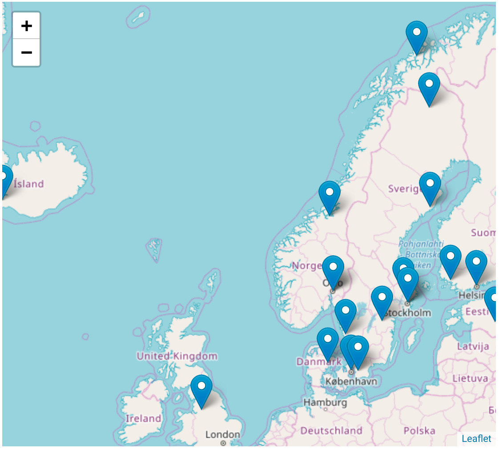

## Coding like it’s 1969

.footnote[Bundesarchiv, B 145 Bild-F038812-0014, Lothar Schaack (CC-BY-SA 3.0 DE)]

---

class: center, middle, inverse

# Research software engineering recipes for the next two decades

## Radovan Bast [@\_\_radovan](https://twitter.com/__radovan)

Nordic e-Infrastructure Collaboration/
UiT The Arctic University of Norway

---

## About me

- Theoretical chemist turned research software engineer.
- I write research software and teach programming to researchers and lead the
  [CodeRefinery project](https://coderefinery.org).

.left-column[
### Projects

- DIRAC
- Dalton
- OpenRSP
- XCint
- XCFun
- Numgrid
- GIMIC
- Parselglossy
- Autocmake
- Runtest
- Sonar
- Smeshing
]

.right-column[
### Credits

- Roberto Di Remigio
- Jonas Juselius
- Richard Darst
- CodeRefinery team
]

---

## CodeRefinery

We teach tools and practices for the
development of reproducible and reusable research software.

- https://coderefinery.org
- https://coderefinery.org/workshops/

---

## CodeRefinery

- We have trained .emph[over 550 students and researchers]
- Across all academic disciplines
- Funding for 2.5 more years

### Our goal

Advance .emph[FAIRness] of software management and development practices so that research groups can
.emph[collaboratively develop], review, discuss, test, share, and reuse their codes.

---

## CodeRefinery

### Our [lessons](https://coderefinery.org/lessons/)

- Basic and collaborative Git
- Git branch design
- Code documentation
- Automated testing
- Jupyter notebooks
- Integrated development environments
- Building portable code with CMake
- Social coding and open software
- Modular code development
- Reproducible research

---

## Goals for this talk

### - Lessons learned from teaching 20 workshops on research software engineering

### - Challenges for the next two decades

- FAIRness in research software development
- Peer review and code review
- Software engineering and academic credit
- Training needs

---

## CodeRefinery: what is our impact? (1/2)

.footnote[https://coderefinery.org]

---

## CodeRefinery: what is our impact? (2/2)

.footnote[https://coderefinery.org]

---

## CodeRefinery: lessons learned

### Demand

- .emph[Demand for training] is huge.
- [The Carpentries](https://carpentries.org) offer great courses in basics but there is .emph[need for more advanced courses].

### Collaborative version control

- Around a third of workshop participants are new to .emph[version control].
- Very few participants use .emph[code review] and .emph[automated testing] before arriving at our workshop.

### FAIR

- .emph[Software licensing and copyright] aspects are new to most participants.
- Code publishing and .emph[code citation principles] are new to most participants.
- .emph[FAIR principles] in software management are far from standard.

---

the paper

---

class: center, middle, inverse

## Software reproducibility 10-year challenge:

# Try to build **your code** from 10 years ago

---

## Software reproducibility 10-year challenge

### Couple of uncomfortable questions:

- Can you still .emph[find] your code?
- It was probably not on GitHub (GitHub launched only 11 years ago, GitLab is only 6 years old).
- Can you bring it to a .emph[well-defined state]?
- Can you bring its documentation to refer to the same state?
- How about .emph[external dependencies]? Have you locked their versions?
- Have you used Git submodules? Have they moved?
- Any hard-coded paths?
- If you manage to build it, how do you know it produces the same results as in the past?

---

## Have you ever seen these sentences?

.quote["software used in this study is available upon request"]

- What does this mean in terms of findability and accessibility?

.quote["we have used a locally modified version of code X"]

- What does this mean in terms of findability, accessibility, and reproducibility?

---

## Publishing computational results without accompanying code will become unacceptable

.quote["With some exceptions, anything else than the release of source programs is intolerable for results that depend on computation"]
.cite[Ince, D. C., Hatton, L. & Graham-Cumming, J., Nature 482, 485 (2012)]

.quote["Programs should be published in source language (rather than binary)"]
.cite[Roberts, K. V., Comput. Phys. Comm. 1, 1 (1969)]

.quote["The scientific community should always be able to verify that a published program will produce correct results"]
.cite[Roberts, K. V., Comput. Phys. Comm. 1, 1 (1969)]

---

## Public access alone may not be enough

- Putting your code on GitHub/GitLab does not guarantee that the software is findable and accessible in the future.
- How about the persistence of the service and repository and versions?
- The average lifetime of a web address has been estimated to be 44 days. .cite[Kahle, B. Preserving the Internet. Scientific American (July 27, 1998)]
- Assigning a .emph[digital object identifier] (DOI) to the version referenced in a published manuscript .emph[is a must].

### Great services to get a DOI:

- [Zenodo](https://zenodo.org)
- [Open Science Framework](https://osf.io)
- [Software Heritage](https://www.softwareheritage.org)
- [Dataverse](https://dataverse.org)
- [Figshare](https://figshare.com)

.quote["A published program will form part of a permanent international literature"]
.cite[Roberts, K. V., Comput. Phys. Comm. 1, 1 (1969)]

---

Code review should become a standard practice

---

## FAIR principles

The FAIR Guiding Principles for scientific **data** management and stewardship (https://www.nature.com/articles/sdata201618):

- To be .emph[**F**indable]
- To be .emph[**A**ccessible]
- To be .emph[**I**nteroperable]
- To be .emph[**R**eusable]

For a discussion of FAIR in the context of software, see https://softdev4research.github.io/4OSS-lesson/.

---

## Where are software management plans?

.emph[**Data** is part of research output]

- Funding agencies often ask for a data management plan

.emph[**Software** is part of research output]

Curiosity: Not too many projects consider a software management plan **yet**.

Software development should consider .emph[FAIR principles, ideally from the start].

---

Dependencies and package management

---

Sharing code and encouraging derivative work may boost your academic impact

---

respect version control

---

version control without code review

---

how code review works

---

why code review

- learning

---

forking

- licenses
- open master

---

## Social coding

.cite[Idea: R. Darst, adapted]

- Whether you can share your output depends on how you obtained your input.
- Software licenses matter.
- Sometimes "OTHERS" are you yourself in the future.

---

developer of QC code:
"i don't have time to learn tool x, i am a chemist"

experimental spectroscopist:
"i don't have time to learn how the instrument works, i am a chemist"

"we don't need tests, we are not a software company"

"we don't need a NMR calibration sample, we are not a pharma company"

---

## Programming languages

- A programming language perfect for everything does not exist yet.
- Each language has its .emph[own strengths].
- .emph[Often we do not have the choice] since we enter an existing project.
- If you choose an exotic programming language, you may get fewer .emph[collaborators].

### It is important that we learn/teach how to interface languages

- C is the *lingua franca*.
- Python/C (CFFI)
- Python/C++ (pybind11)
- Python/Fortran (CFFI via `iso_c_binding`)

### Personal opinions

- .emph[Python] has a rich ecosystem and very active community.
- Prefer Python over Matlab since Python is free.
- Rust is underrated. Python/Rust looks like a great combination.

---

iterop
pypi
conda
semver
interop data

---

Establishing a culture and the need for training

---

credit

---

challenges

---

code reading sessions

---

conclusions

link to these slides
